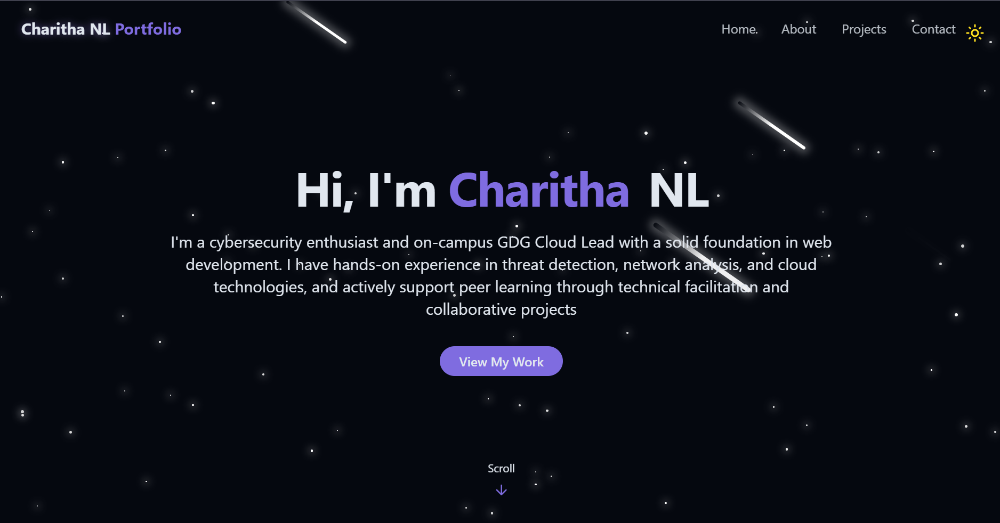

# Build a Modern Portfolio Website with React & TailwindCSS

<div align="center">
  <br />
  
  <br />
  <div>
    
    
    
    
    
  </div>
  <h3 align="center">My Personal Developer Portfolio</h3>
  <div align="center">
    Built with React, TailwindCSS, and Vite – showcasing my work, skills, and contact information.
  </div>
  <br />
</div>

## 📋 Table of Contents

1. [Introduction](#-introduction)
2. [Tech Stack](#-tech-stack)
3. [Features](#-features)
4. [Quick Start](#-quick-start)
5. [Screenshots](#-screenshots)
6. [Deployment](#-deployment)

---

## 🚀 Introduction

This is my modern, fully responsive developer portfolio website built using **React**, **TailwindCSS**, and **Vite**. It includes animations, dark/light mode, a project showcase, and a contact form.

---

## ⚙️ Tech Stack

- **React**
- **Vite**
- **TailwindCSS**
- **Lucide Icons**
- **Radix UI**
- **GitHub + Vercel**

---

## ⚡️ Features

- 🌑 Dark & Light mode toggle
- 💫 Smooth animations
- 📱 Mobile responsive design
- 🧑‍💻 About Me section
- 🖼️ Projects gallery with GitHub/demo links
- 📬 Contact form with toast notifications
- 🚀 Easy deployment

---

## 👌 Quick Start

### Prerequisites

- [Node.js](https://nodejs.org/)
- [Git](https://git-scm.com/)

### Run Locally

```bash
git clone https://github.com/Charithanl/charitha-portfolio.git
cd charitha-portfolio
npm install
npm run dev

